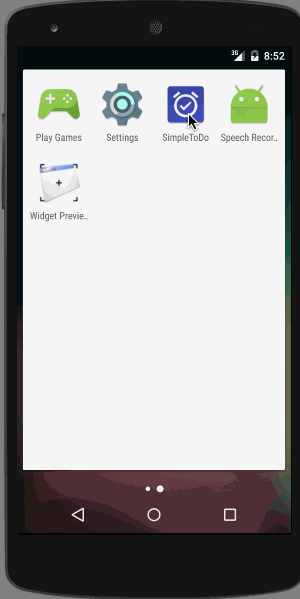
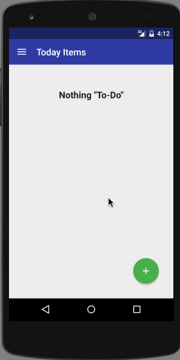
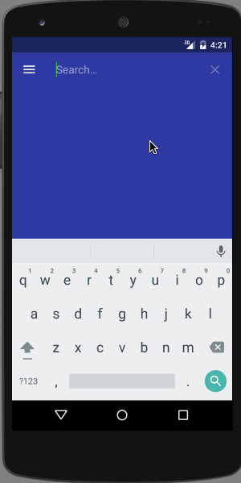
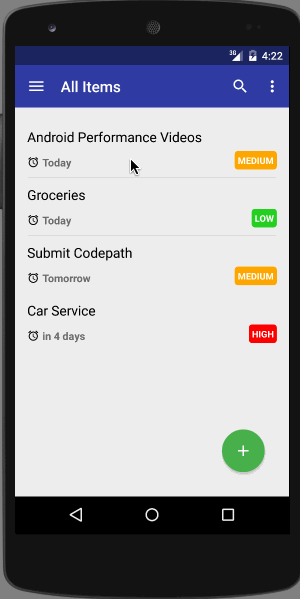
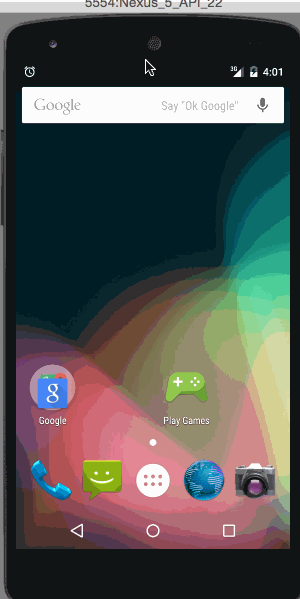
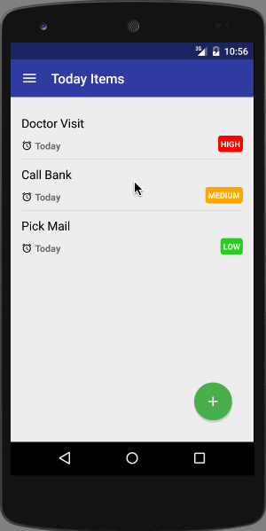
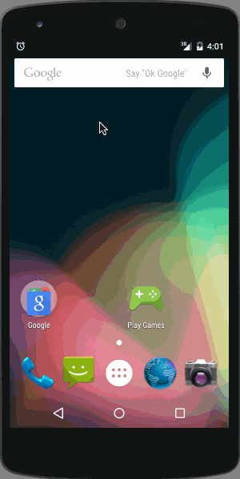

# SimpleToDO Demo

This is an Android demo application for managing ToDo items. See the [instructions](http://courses.codepath.com/snippets/intro_to_android/prework) for reference.

## Version 4
Time spent: Approximately 20 hours (total including Initial Submission, Version 2 & 3)

List displays the Todo items (via 'All Items' in navigation drawer ) sorted in the following order:
* Date Ascending
* Priority Descending (High, Medium & Low)
* Name Ascending

Completed user stories:

 * [x] Required: Add and remove items from the todo list
 * [x] Required: Support for editing todo items
 * [x] Required: Persist todo items
 * [x] Suggested: Persist the todo items into SQLite instead of a text file
 * [x] Suggested: Improve style of the todo items in the list using a custom adapter
 * [x] Suggested: Add support for completion due dates for todo items (and display within listview item)
 * [x] Additional: Added description field to todo item 
 * [x] Additional: Used a Recycler view to display todo items 
 * [x] Additional: Add support for selecting the priority of each todo item (and display in listview item)
 * [x] Additional: Tweak the style improving the UI / UX, play with colors, images or backgrounds
 * [x] Additional: Provided Date & Priority pickers via DialogFragment (Instead of editing items via DialogFragment as a toolbar is not usual for DialogFragments)
 * [x] Additional: Some material design aspects: Floating Action Button, Navigation Drawer
 * [x] Additional: Navigation Drawer (Provides the ability to toggle between Todays Items, Overdue Items, All Items & High Priority Items)
 * [x] Additional: Ability to mark an item as complete   
 * [x] Additional: Mechanism to delete completed items
 * [x] Additional: Mechanism to delete all items
 * [x] Additional: Recurring notification at 4 AM everyday (via Intent Service and Broadcast Receivers)
 * [x] Additional: Ability to search within all ToDoItems (leveraging android provided SearchView, searches in name and description fields, case insensitive and does "contains" search via SQL LIKE and wildcards)
 * [x] Additional: Ability to share a ToDoItem as plain text (via "ACTION_SEND" Intent)

Walkthrough of all user stories:

### All Features

### Date & Priority Picker

### Search

### Share (Please note only Messaging app matches "ACTION_SEND" text/plain on the emulator)

### Notification Demo

## Version 3
Time spent: Approximately 15-18 hours  (total including Initial Submission & Version 2)

List displays the Todo items (via 'All Items' in navigation drawer ) sorted in the following order:
* Date Ascending
* Priority Descending (High, Medium & Low)
* Name Ascending

Completed user stories:

 * [x] Required: Add and remove items from the todo list
 * [x] Required: Support for editing todo items
 * [x] Required: Persist todo items
 * [x] Suggested: Persist the todo items into SQLite instead of a text file
 * [x] Suggested: Improve style of the todo items in the list using a custom adapter
 * [x] Suggested: Add support for completion due dates for todo items (and display within listview item)
 * [x] Additional: Added description field to todo item 
 * [x] Additional: Used a Recycler view to display todo items 
 * [x] Additional: Add support for selecting the priority of each todo item (and display in listview item)
 * [x] Additional: Tweak the style improving the UI / UX, play with colors, images or backgrounds.
 * [x] Additional: Ability to mark an item as complete
 * [x] Additional: Provided Date & Priority pickers via DialogFragment (Instead of editing items via DialogFragment as a toolbar is not usual for DialogFragments)
 * [x] Additional: Some material design aspects: Floating Action Button, Navigation Drawer
 * [x] Additional: Navigation Drawer (Provides the ability to toggle between Todays Items, All Items & High Priority Items options)
 * [x] Additional: Mechanism to delete all items
 * [x] Additional: Recurring notification at 4 AM everyday (via Intent Service and Broadcast Receivers)

Walkthrough of all user stories:

### All Features

### Notification Demo

## Version 2
Time spent: Approximately 10-15 hours (total including Initial Submission)

List displays the Todo items sorted in the following order: (By default past items are hidden and a overflow menu options are available to show/hide past items)
* Date Ascending
* Priority Descending (High, Medium & Low)
* Name Ascending

Completed user stories:

 * [x] Required: Add and remove items from the todo list
 * [x] Required: Support for editing todo items
 * [x] Required: Persist todo items
 * [x] Suggested: Persist the todo items into SQLite instead of a text file
 * [x] Suggested: Improve style of the todo items in the list using a custom adapter
 * [x] Suggested: Add support for completion due dates for todo items (and display within listview item)
 * [x] Additional: Add support for selecting the priority of each todo item (and display in listview item)
 * [x] Additional: Tweak the style improving the UI / UX, play with colors, images or backgrounds 
 * [x] Additional: Provided Date & Priority pickers via DialogFragment (Instead of editing items via DialogFragment as a toolbar is not usual for DialogFragments)
 * [x] Additional: By default the list doesn't include the past items. Provided mechanism to toggle showing/hiding past items. Also provided a mechanism to delete all items
 * [x] Additional: Added description field to todo item

Walkthrough of all user stories:

## Initial Submission
Time spent: 2 hours spent in total

Completed user stories:

 * [x] Required: Add and remove items from the todo list
 * [x] Required: Support for editing todo items
 * [x] Required: Persist todo items
 
Walkthrough of all user stories:

GIF created with [LiceCap](http://www.cockos.com/licecap/).
