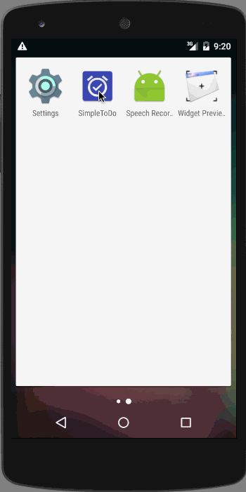
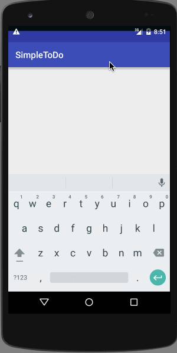

# SimpleToDO Demo

This is an Android demo application for managing ToDo items. See the [instructions](http://courses.codepath.com/snippets/intro_to_android/prework) for reference.

## Version 2
Time spent: Approximately 10-15 hours

List displays the Todo items sorted in the following order: (By default past items are hidden and a overflow menu options are available to show/hide past items)
* Date Ascending
* Priority Descending (High, Medium & Low)
* Name Ascending

Completed user stories:

 * [x] Required: Add and remove items from the todo list
 * [x] Required: Support for editing todo items
 * [x] Required: Persist todo items
 * [x] Suggested: Persist the todo items into SQLite instead of a text file
 * [x] Suggested: Improve style of the todo items in the list using a custom adapter
 * [x] Suggested: Add support for completion due dates for todo items (and display within listview item)
 * [x] Additional: Add support for selecting the priority of each todo item (and display in listview item)
 * [x] Additional: Tweak the style improving the UI / UX, play with colors, images or backgrounds 
 * [x] Additional: Provided Date & Priority pickers via DialogFragment (Instead of editing items via DialogFragment as a toolbar is not usual for DialogFragments)
 * [x] Additional: By default the list doesn't include the past items. Provided mechanism to toggle showing/hiding past items. Also provided a mechanism to delete all items
 * [x] Additional: Added description field to todo item

Walkthrough of all user stories:

## Initial Submission
Time spent: 2 hours spent in total

Completed user stories:

 * [x] Required: Add and remove items from the todo list
 * [x] Required: Support for editing todo items
 * [x] Required: Persist todo items
 
Walkthrough of all user stories:

GIF created with [LiceCap](http://www.cockos.com/licecap/).
